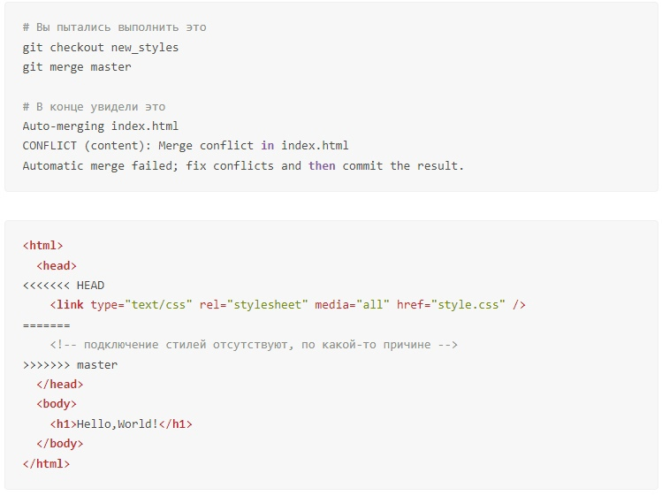

# Инструкция для работы с Git и удаленными репозиториями

## Что такое Git?

Git - это одна из реализаций распределенных систем контоля версий, имеющая как и локальные, так и удаленные репозитории. Является самой популярной реализацией систем контроля версий в мире.
## Подготовка репозитория 
для создания репозитория необходимо выполнить команду *git init* в папке с репозиторием и у Вас создаться репозиторий (появится скрытая папка .git)

## Создание коммитов

### Git add
Для добавления изменений в коммит используется команда *git add*. Чтобы использовать команду *git status*, и Вы увидите были ли изменения в файлах, или их не было.

### Создание комитов
Для того, чтобы создать коммит(сохранение) необходимо выполнить команду *git commit* 

## Основные команды Git
+ **git init** – инициализация локального репозитория

+ **git status** – получить информацию от git о его текущем состоянии
+ **git add** – добавить файл или файлы к следующему коммиту
+ **git commit -m “message”** – создание коммита.
+ **git log** – вывод на экран истории всех коммитов с их хеш-кодами
+ **git checkout** – переход от одного коммита к другому
+ **git checkout master** – вернуться к актуальному состоянию и продолжить работу
+ **git diff** – увидеть разницу между текущим файлом и закоммиченным файлом

# Совместная работа
## Ветка
Ветка - это набор commit, которые идут друг за другом. У ветки есть название, основную ветку называют master. Ветка master - это наш проект.

Другие ветки - это отдельное место для реализации нового функционала или исправление багов (ошибок) нашего проекта. То есть, с отдельной веткой вы делаете что угодно, а затем сливаете эти изменения в основную ветку master.

Для того, чтобы создать новую ветку вводим:

**git branch <название_ветки>** или **git checkout -b <название_ветки>**

После того, как вы завершили работу над своей задачей, ветку можно слить в master . Для этого нужно переключиться в ветку master и выполнить следующую команду:

Переключаемся в master **git checkout master** Обновляем локальную ветку с сервера **git pull origin master**
Делаем **merge** вашей ветки, в ветку в которой вы находитесь В данном примере это **master git merge <название_ветки>**

Команда **merge** берет все изменения из ветки и добавляет их в ветку master.

Другие пользователи не увидят вашу ветку, пока она не будет отправлена на удаленный репозиторий. Поэтому, после того как вы слили все изменения в master , нужно отправить их в GitHub. Для этого обязательно нужно находиться в ветке master : **git checkout master**

Отправляем наши изменения в GitHub:
**git push origin master**

## Ошибки при слиянии веток

Git старается автоматически сливать изменения, однако это не всегда возможно. Иногда возникают конфликты. Например, когда в двух ветках были изменения в одной и той же строчке кода. Если такое произошло, то необходимо разрешить конфликт вручную. Для этого откройте файл там, где этого произошло. Например, вы можете увидеть что-то подобное:

После внесения нужных изменений добавьте ваш файл через git add <имя_файла> как измененный и создайте новый commit:

**git add index.html**
**git commit -m "Merged master fixed conflict."**

## Вспомогательные команды
Просмотреть изменения относительно двух веток можно командой:
**git diff <исходная_ветка> <целевая_ветка>**

Удалить ненужную ветку:
**git branch -d <название_ветки>**

Просмотр историю ветки:
**git log**